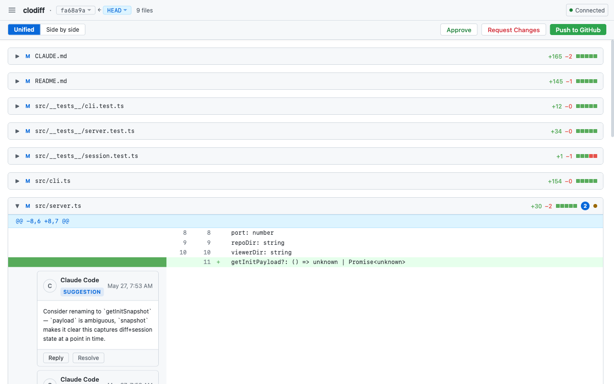
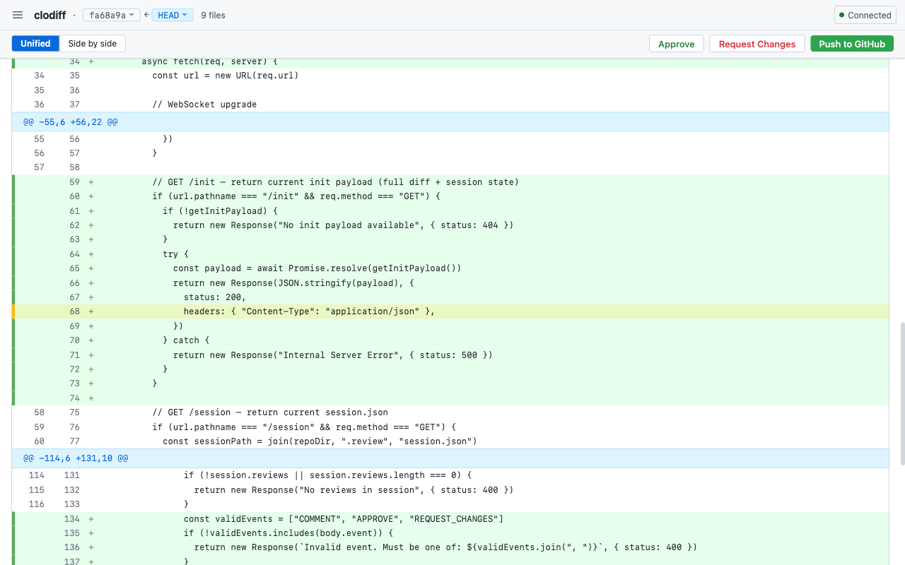

# clodiff

A local code viewer for Claude. Run it in any repo and Claude can navigate it, highlight lines, and leave inline annotations while talking with you — a shared visual context for code discussions.





---

## Installation

```bash
bunx clodiff      # no install needed
npx clodiff
```

Or globally:

```bash
bun add -g clodiff
clodiff
```

---

## Usage

```bash
# Browse the repo (no diff)
clodiff

# Show changes against a branch
clodiff --base main

# Show a specific commit range
clodiff --from HEAD~3 --to HEAD

# Pipe a diff from stdin
git diff HEAD~1 | clodiff --stdin

# Load a patch file
clodiff --patch my.patch
```

```
Options:
  --base <branch>    Diff against a branch
  --from <ref>       Start of range (requires --to)
  --to <ref>         End of range (requires --from)
  --stdin            Read diff from stdin
  --patch <path>     Read diff from a patch file
  --port <number>    Port to listen on (default: 7777)
  --resume           Resume existing session without warning
  --install-hooks    Install Claude Code hooks into .claude/settings.json
```

---

## Claude Code integration

Install the hooks and skill once per repo:

```bash
clodiff --install-hooks
```

This installs:
- **Hooks** — injects pending annotation replies into each prompt, and loads session state at startup
- **`clodiff` skill** — teaches Claude how and when to use the viewer (scroll, highlight, annotate)
- **`clodiff-review` skill** — a built-in PR review workflow that leaves inline annotations and supports Approve / Request Changes / Push to GitHub

Once installed, Claude will detect an active clodiff session and use the viewer during code discussions. Ask it to review your diff and it will annotate the code inline. See `CLAUDE.md` for the full protocol.

---

## Session

State is stored in `.review/session.json`. The `.review/` directory is added to `.gitignore` automatically.

---

## Development

```bash
bun install
bun test
```
