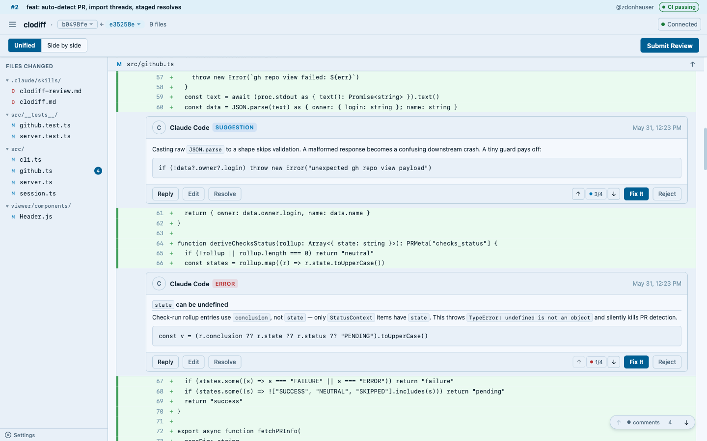
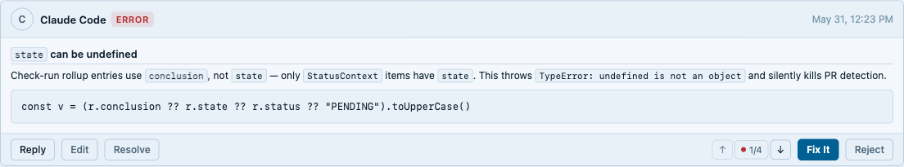
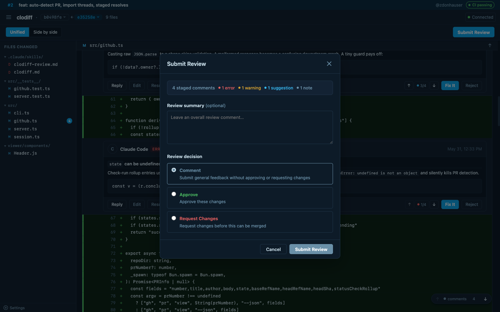

# clodiff

A local code review viewer for Claude Code. Run it in any repo and Claude can navigate the diff, highlight lines, leave inline annotations, and submit full GitHub PR reviews — all from a shared browser window.


<details>
<summary>Prefer light mode? It follows your system theme.</summary>



</details>

---

## Installation

clodiff runs on [Bun](https://bun.sh). Install Bun first if you don't have it:

```bash
# macOS / Linux / WSL
curl -fsSL https://bun.sh/install | bash
# Windows (PowerShell)
powershell -c "irm bun.sh/install.ps1 | iex"
```

(`which bun` should print a path afterwards; you may need to restart your shell so `~/.bun/bin` is on `PATH`.)

Then install clodiff and run it:

```bash
bun add -g clodiff
clodiff
```

Or run without installing:

```bash
bunx clodiff
```

> In sandboxed environments where `bunx`'s download-and-execute is blocked,
> use the global install (`bun add -g clodiff`) and run the `clodiff` binary.

---

## Usage

### Uncommitted changes (the default)

```bash
clodiff                      # uncommitted changes vs the last commit
                             # (tracked + untracked files) — unless the branch
                             # has an open PR, in which case PR review wins
clodiff --working            # force uncommitted-vs-HEAD even on a PR branch
clodiff --working --base main   # uncommitted changes vs another branch
```

### Local branch review

```bash
clodiff --base main          # working tree (incl. uncommitted) vs a branch
clodiff --from HEAD~3 --to HEAD   # specific commit range
git diff HEAD~1 | clodiff --stdin # pipe a diff from any source
clodiff --patch my.patch     # load a patch file
```

### PR review

```bash
clodiff                      # on a PR branch — auto-detects the open PR,
                             # fetches the diff, imports existing review threads,
                             # and loads PR metadata (title, author, CI status)

clodiff --pr 42              # explicit PR number (when not on the branch)
```

You can also change the two diff endpoints live from the header (the **base ← compare**
pickers, with a "working tree" option), or programmatically via `POST /rediff` — see
[Server API](#server-api).

The `--pr` flag (or auto-detection) enables the full PR review workflow:
existing GitHub review comments are imported into the session so you can see
what others have already said, and resolving threads is staged for GitHub sync
on submit.

### All flags

```
--working          Uncommitted changes vs HEAD (or --base <ref>); tracked + untracked
--base <branch>    Working tree vs a branch (local mode)
--from <ref>       Start of range (requires --to)
--to <ref>         End of range (requires --from)
--pr <number>      Set PR number for GitHub submit/import
--stdin            Read diff from stdin
--patch <path>     Read diff from a patch file
--port <number>    Port to listen on (default: 7777, auto-increments if taken)
--resume           Resume existing session without warning
```

---

## Features

### Inline annotations

Claude (or any code review tool) writes findings directly into the session.
Annotations appear as comment cards alongside the relevant diff lines with:

- **Severity levels** — error, warning, suggestion, note
- **Markdown rendering** — full GitHub-flavored markdown in comment bodies
  (headings, code fences, tables, task lists, links)
- **Reply threading** — reply to any annotation inline; Claude can respond
  in-thread without needing a new chat message
- **Edit before submit** — click Edit on any annotation to refine the wording
  before it goes to GitHub



### Comment navigation

A floating pill in the bottom-right corner shows the current comment's severity
and position (e.g. "3/7"). ↑/↓ navigate in severity order (errors first).
The same arrows appear on each comment card. Fix It and Reject automatically
advance to the next comment.

### Submit Review (PR mode)

The **Submit Review** button opens a modal where you:

1. Choose the review decision — Approve, Request Changes, or Comment
2. Write an optional review summary body
3. See staged comment counts by severity
4. Submit — which sets the event, posts the body, pushes all annotations
   to GitHub as a PR review, and resolves any threads you marked resolved

GitHub's restriction that you cannot approve your own PR is detected and
the Approve option is disabled with an explanation.



### Sticky file headers

A sticky bar shows the current file name as you scroll through a multi-file
diff so you always know which file you're looking at.

---

## Session

State lives in `.review/session.json` (auto-added to `.gitignore`). The file
stores the diff metadata, all annotations, reply threads, pending GitHub thread
resolves, PR metadata, and the server port. Restarting clodiff with `--resume`
continues where you left off.

---

## Server API

The viewer communicates with the server over HTTP and WebSocket. Key endpoints:

| Method | Path | Description |
|--------|------|-------------|
| `GET` | `/init` | Full diff + session payload (WebSocket sends this on connect) |
| `GET` | `/session` | Current session.json |
| `POST` | `/reply` | Add a reply to a comment thread. `source: "claude-code"` skips the monitor queue and renders a styled inline response card |
| `POST` | `/action` | Record Fix It / Reject decision — resolves the comment and notifies the monitor via `replies.json` without creating a visible reply bubble |
| `POST` | `/resolve` | Resolve a comment; stages its GitHub thread ID for sync on submit |
| `POST` | `/edit-comment` | Update a comment body |
| `POST` | `/review/body` | Set the overall review summary text |
| `POST` | `/review/event` | Set the review decision (APPROVE / REQUEST_CHANGES / COMMENT) |
| `POST` | `/push` | Submit the review to GitHub, then resolve any pending threads |
| `POST` | `/rediff` | Re-run the diff with new from/to refs |
| `POST` | `/_ws_broadcast` | Broadcast a WebSocket message to all connected viewers |
| `GET` | `/file?path=` | Read a file from the repo (for full-file context) |
| `GET` | `/refs` | List local branches |
| `GET` | `/tree` | List tracked files |

WebSocket message types: `init`, `session_update`, `scroll_to`, `highlight`.

### Monitor / reply flow

User replies are written to `.review/replies.json`. A monitor (set up by the
clodiff-review skill) polls this file and notifies Claude of new replies. Claude
responds via `POST /reply` with `source: "claude-code"`, which writes the
response directly into the session's comment thread and broadcasts a
`session_update` — no separate chat message needed.

---

## Claude Code integration

Install the **clodiff plugin** from [clogins](https://github.com/zdonhauser/clogins):

```
/plugin marketplace add github:zdonhauser/clogins
/plugin install clodiff@clogins
```

This installs two skills and three hooks:

- **`clodiff` skill** — teaches Claude to start clodiff, navigate the viewer,
  highlight lines, and leave inline annotations during any code discussion
- **`clodiff-review` skill** — the viewer/UI layer for code review: reviews a
  PR or local changes when no other engine is named, or displays findings that
  already exist, as inline annotations staged for a GitHub PR review
- **`inject-replies` hook** — injects pending viewer replies into every prompt
  so you can reply to annotations without leaving the viewer
- **`nudge-review` hook** — when a clodiff session is live and your prompt looks
  like a review (including ones that name another engine, e.g. a security review
  or `ultrareview`), reminds Claude to render the findings as annotations in the
  viewer — so any review flow surfaces in clodiff without it overriding the
  engine you asked for
- **`load-session` hook** — loads clodiff session state at startup so Claude
  is always aware of an active session

---

## Development

```bash
bun install
bun test        # 150 tests across server, CLI, diff parser, GitHub API, anchoring
```
